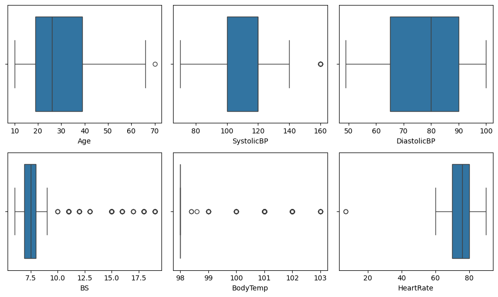
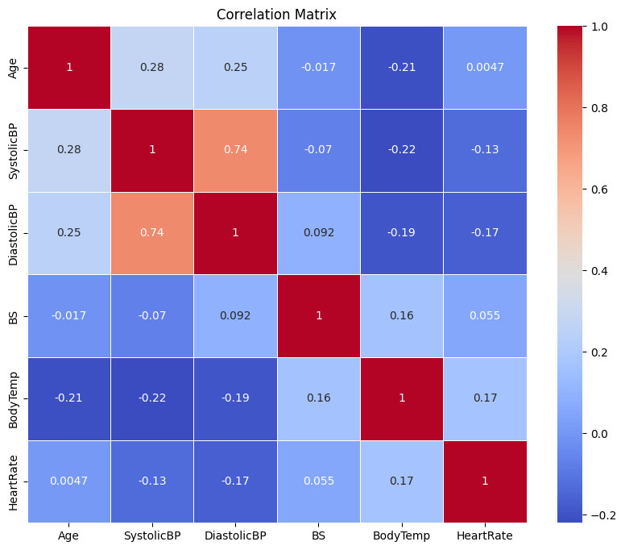
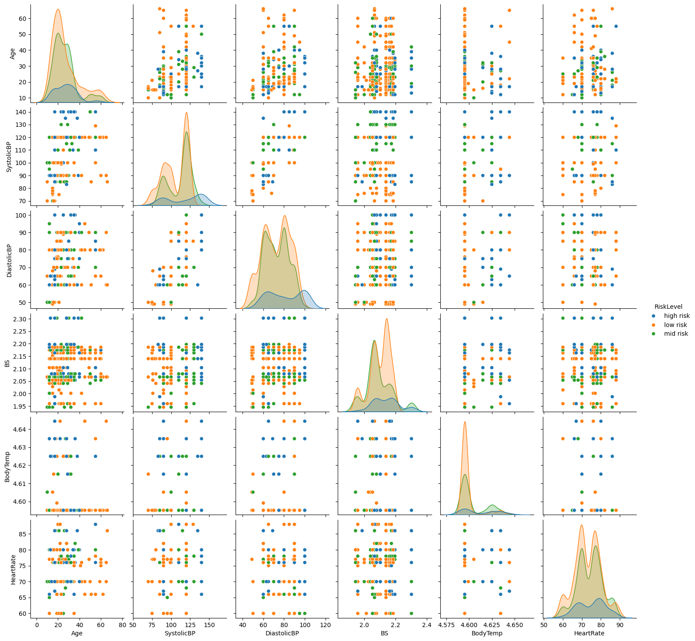
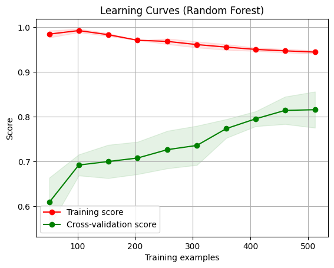

# Predictive Analysis of martenal health risk levels using machine learning
## Final Project
## Background
Maternal health remains a crucial concern in global health, particularly in under-resourced areas where the rates of maternal mortality are alarmingly high. Early detection and management of maternal health risks are vital in preventing complications that can jeopardize the health of both mothers and their infants. Utilizing machine learning techniques can lead to more accurate predictions, improved allocation of healthcare resources, and timely medical interventions, ultimately enhancing the quality of maternal care and reducing adverse outcomes.

## Objective:
Create a machine learning model to forecast maternal health risk levels using key physiological indicators. 
Enable early detection of potential health risks in expectant mothers, facilitating timely and appropriate medical interventions to improve health outcomes for both mothers and infants.
## Dataset
Data was downloaded on  
Link : Datasets - UCI Machine Learning Repository. https://archive.ics.uci.edu/dataset/863/maternal+health+risk  .
The dataset has 1013 instances and 7 Variables and has no missing values
### Variables
* Age                                                                   
The age of the expectant mother in years.

* Systolic Blood Pressure (SystolicBP) 
:The pressure in the arteries when the heart beats and fills them with blood, measured in millimeters of mercury (mmHg).

* Diastolic Blood Pressure (Diastolic)
:The pressure in the arteries when the heart rests between beats, measured in millimeters of mercury (mmHg)

* Blood Sugar (BS) 
:The level of glucose in the blood, typically measured in milligrams per deciliter (mg/dL).

* Body Temperature (Body Temp)
:The temperature of the body, usually measured in degrees Celsius (°C) or Fahrenheit (°F).

* Heart Rate (Heart Rate) 
:The number of heart beats per minute.

* Risk Level (RiskLevel) 
:The classification of the expectant mother's health risk during pregnancy, often categorized into levels such as low, medium, and high risk.

## Process Overview
### Data Preprocessing:
Data Cleaning: Handle missing values, remove duplicates, and correct inconsistencies in the dataset.

Normalization/Scaling: Normalize or scale numerical features to ensure uniformity across the dataset.
### Exploratory Data Analysis (EDA):
Statistical Summary: Generate summary statistics for each variable to understand the dataset's characteristics.

Data Visualization: Create visualizations like histograms, box plots, and correlation matrices to identify patterns and relationships.

Outlier Detection: Identify and handle outliers that may skew the model's performance
### Model Development:
Train-Test Split: Split the data into training and testing sets to evaluate model performance.

Model Selection: Choose appropriate machine learning algorithms (e.g., Logistic Regression, Decision Trees, Random Forest, Gradient Boosting, Support Vector Machines).

Training: Train multiple models on the training dataset.

Hyperparameter Tuning: Optimize model parameters using techniques like Grid Search or Random Search.
### Model Evaluation:
Performance Metrics: Evaluate models using metrics such as accuracy, precision, recall, F1-score, and ROC-AUC score.

Cross-Validation: Perform cross-validation to ensure the model's robustness and generalizability.
### Model Interpretation:
Feature Importance: Analyze which features contribute most to the predictions.

Learning Curve

## Data Visualization

## Summary Statistics
#

### Interpretation of the Histograms:

#### Age:
Distribution: The age distribution is skewed to the right, with most values concentrated between 10 and 40 years. This indicates that most of the subjects are younger, which is typical for maternal health datasets.
#### Systolic Blood Pressure (SystolicBP):
Distribution: The histogram shows a bimodal distribution with peaks around 110-120 mmHg and another smaller peak around 140 mmHg. This suggests that while most subjects have normal systolic blood pressure, there are significant numbers with higher blood pressure.
#### Diastolic Blood Pressure (DiastolicBP):
Distribution: The distribution is multimodal with peaks around 60, 80, and 90 mmHg. This indicates a varied range of diastolic blood pressure values, with a significant number of subjects having elevated diastolic blood pressure.
#### Blood Sugar (BS):
Distribution: The blood sugar levels are right-skewed, with most values clustering around 6-8 mg/dL. There are some outliers with higher blood sugar levels, indicating potential cases of hyperglycemia or gestational diabetes.
#### Body Temperature (BodyTemp):
Distribution: The body temperature is heavily skewed to the left, with most values around 98°F. There are very few instances of higher body temperatures, which could indicate fevers or infections in a small number of subjects.
#### Heart Rate (HeartRate):
Distribution: The heart rate distribution is slightly right skewed, with most values ranging from 60 to 80 beats per minute. This suggests that most subjects have heart rates within the normal range, with a few cases of elevated heart rates.

Women from age group of 10-19 yeas and  20-29 years tend to have a low martenal health risk,this is attributed to the fact that younger women are often in better overall physical health and have a lower incidence of chronic diseases that can complicate pregnancy. Martenal health risk levels tends to be high from the age of 30 upto 59 because women aged 30-59 are considered to be of advanced maternal age. Pregnancy at this age can increase the risk of complications such as gestational diabetes, hypertension, preeclampsia, and chromosomal abnormalities like Down syndrome. The body’s ability to handle the physiological demands of pregnancy decreases with age.After the age of 59 the risk are low because thats the stage where women starts to reach menopause.

## Outlier Detection

### Transformations
Since there are outliers we employed the log transformations to see if the variables with outliers have changed  
applied the log transformation to BS (blood sugar)  and Body temperature , as they were  heavily skewed.There was no change on the graphs so the other 
method to deal with the outliers was to remove them.
Standardization: apply standardization to all numerical variables.

### Correlation Matrix

* strong positive relationship between systolic bp and diastolic bp
* Weak positive relationship between age and systolic bp,age and diastolic bp ,diastolic bp and body temperature Heart rate and blod sugar as well as body temperature

### Pairplot

•	Blood pressure metrics (SystolicBP and DiastolicBP) appear to be key indicators of risk level, with higher values correlating with higher risk.

•	Age, BodyTemp, BS, and HeartRate show less clear differentiation among the risk levels, suggesting that they may not be as strong individual predictors of risk.

•	The overlapping distributions in several variables indicate that a combination of factors, rather than any single variable, might be necessary for accurate risk prediction.

## Feature Engineering
Transformed categorical variables into a numerical format suitable for machine learning models.
Label Encoding: The Risk Level.This was used as it assumes ordinal relationships between classes
 
## Model Development
### Train test split (Purpose)
The dataset was split into 80% training and 20% testing sets to ensure a balanced dataset presentation.
Assessing model performance on unseen data.
Preventing overfitting and ensuring generalization.
Providing an unbiased evaluation during model selection and hyperparameter tuning.
#### Training shape:
Training set size: 640
Testing set size: 161
### Models Employed
* decision trees
* Random forests 
* SVM

For model selection in predicting maternal health risks, we evaluated several classifiers to determine the most effective approach. The classifiers considered were:
Decision Tree Classifier, Random Forest Classifier, Support Vector Clasifier

#### Pipeline
Pipelines help to automate and streamline the process of applying data preprocessing steps and fitting models. They ensure that all necessary steps are applied consistently across different models. They also contribute to data leakage prevention by ensuring that the preprocessing steps are fitted only on the training data and not on the test data and for that reason we used them.
#### Setting hyperparameters for grid search
This helps in fine tuning the models we are using for this study in these ways. Optimizing Model Performance by finding the best hyperparameters to maximize model accuracy and reliability.
### Hyperparameters used are as follows:
#### 1.Decision tree :
max_depth [3, 5, 7, 10], Limits the depth of the tree.  These values provide a balance between capturing complexity and avoiding overfitting.

min_samples_split [2, 5, 10]. Specifies the minimum number of samples required to split an internal node

min_samples_leaf [1, 2, 4]. Defines the minimum number of samples that a leaf node must have.
The perfomance metrics and classification reports are as follows:

The high risk class has the best performance metrics in terms of precision and F1-score, indicating that it is predicted with high accuracy and recall.The low risk and mid risk classes have lower precision and recall compared to the high-risk class, suggesting they are less accurately predicted.The accuracy of 0.70 shows that the model is correct 70% of the time overall.The macro average metrics suggest that the model has a balanced performance across different classes, but the weighted average indicates that performance is somewhat lower when accounting for class imbalance.Overall, the model performs better on the high-risk class compared to the other risk levels, and the F1-scores indicate a balance between precision and recall for each class.

#### 2.Random Forest:
  n_estimators': [50, 150, 300, 500, 1000]
  
  max_depth': [None, 15, 30, 45]
  
  min_samples_split': [2, 5, 10, 20]
  
  min_samples_leaf':[1, 2, 4, 6]
    
  The perfomance metrics and classification report:

The model performs quite well overall, with an accuracy of 80%.

High Risk instances are identified accurately, with high precision and recall, suggesting that the model is effective at identifying true high risk cases.

Low Risk instances have a good balance of precision and recall, with slightly higher recall, meaning the model is slightly better at capturing actual low risk instances.

Mid Risk instances also show balanced precision and recall, indicating a similar performance to the other classes.

The macro and weighted averages indicate that the model performs consistently across all classes, without any single class dominating the performance metrics.

This report suggests that the model is well-balanced and performs adequately across different risk levels. The high F1-scores indicate that the model maintains a good balance between precision and recall, which is crucial for balanced classification tasks.
 
  
#### 3.SVM:
C': [0.1, 1, 10, 100, 1000],
gamma': [1, 0.1, 0.01, 0.001, 0.0001],
kernel': ['linear', 'rbf', 'poly', 'sigmoid']

Perfomance metrics and classification report :

       
High Risk Class: The model performs well with high precision and recall, indicating it correctly identifies most high-risk instances.
Low Risk Class: The model shows slightly lower precision compared to high-risk, but recall is high, meaning it can identify most low-risk instances.
Mid Risk Class: The performance is moderate, with balanced precision and recall.
The macro and weighted averages provide an overall view of the model's performance, considering the balance between precision, recall, and F1-score across all classes.

## Best model :
### SVM and Random Forest:
Performance: Both SVM and Random Forest models have similar performance metrics with an accuracy of 80%. They show balanced precision, recall, and F1-scores across the classes.
Confusion Matrix: The confusion matrices for SVM and Random Forest are identical, indicating similar performance and error patterns.SVM and Random Forest models are more effective and consistent compared to the Decision Tree model for this classification task. The Decision Tree model, while performing well in identifying "high risk" instances, shows weaknesses in classifying "low risk" and "mid risk" instances accuratel

The Decision Tree model has lower accuracy (70%) and generally lower precision, recall, and F1-scores compared to SVM and Random Forest. This indicates that the Decision Tree struggles more with correctly classifying instances, particularly for the "low risk" and "mid risk" classes.
The Decision Tree shows a higher number of false negatives for "low risk" and "mid risk" classes, suggesting it misclassifies these instances more often compared to SVM and Random Forest.

### Confusion Matrix

 
## Model interpretability

### Learning curves
#### Random Forest

Overfitting: The high training score and lower cross-validation score suggest that the Random Forest model may be overfitting. The model learns the training data very well but struggles to generalize to new data.

Improvement with More Data: The cross-validation score improves as the number of training examples increases, indicating that the model benefits from more training data.

Potential Ceiling: The plateau in the cross-validation score suggests a potential ceiling in model performance, which might indicate the need for model tuning or the addition of more informative features.

#### SVM

## Future Scope
* Collect More Data:Gather more diverse data to improve model generalization.
* Data Augmentation: Use techniques to generate synthetic data if real data is not available.
* Try Other Algorithms: Test other machine learning models (e.g., Gradient Boosting, XGBoost, LightGBM) to see if they perform better on the data.
* Different Validation Strategies: Use different cross-validation strategies like StratifiedKFold  to get a better understanding of model performance.

## Conclusion
The current model provides a good starting point but may require further refinement to achieve optimal performance.Insights gained from feature importance and performance metrics can guide future data collection and feature engineering efforts.

 

