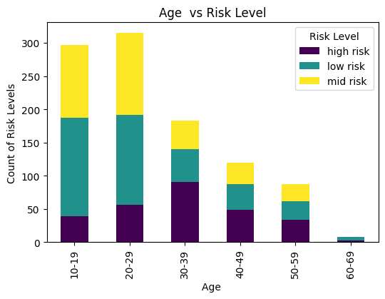

# Predictive Analysis of martenal health risk levels using machine learning
## Final Project
## Background
Maternal health remains a crucial concern in global health, particularly in under-resourced areas where the rates of maternal mortality are alarmingly high. Early detection and management of maternal health risks are vital in preventing complications that can jeopardize the health of both mothers and their infants. Utilizing machine learning techniques can lead to more accurate predictions, improved allocation of healthcare resources, and timely medical interventions, ultimately enhancing the quality of maternal care and reducing adverse outcomes.

## Objective:
Create a machine learning model to forecast maternal health risk levels using key physiological indicators. 
Enable early detection of potential health risks in expectant mothers, facilitating timely and appropriate medical interventions to improve health outcomes for both mothers and infants.
## Dataset
Data was downloaded on  
Link : Datasets - UCI Machine Learning Repository. https://archive.ics.uci.edu/dataset/863/maternal+health+risk  .
The dataset has 1013 instances and 7 Variables and has no missing values
### Variables
Age                                                                   
The age of the expectant mother in years.

Systolic Blood Pressure (SystolicBP) 
:The pressure in the arteries when the heart beats and fills them with blood, measured in millimeters of mercury (mmHg).

Diastolic Blood Pressure (Diastolic)
:The pressure in the arteries when the heart rests between beats, measured in millimeters of mercury (mmHg)

Blood Sugar (BS) 
:The level of glucose in the blood, typically measured in milligrams per deciliter (mg/dL).

Body Temperature (Body Temp)
:The temperature of the body, usually measured in degrees Celsius (°C) or Fahrenheit (°F).

Heart Rate (Heart Rate) 
:The number of heart beats per minute.

Risk Level (RiskLevel) 
:The classification of the expectant mother's health risk during pregnancy, often categorized into levels such as low, medium, and high risk.

## Process Overview
### Data Preprocessing:
Data Cleaning: Handle missing values, remove duplicates, and correct inconsistencies in the dataset.

Normalization/Scaling: Normalize or scale numerical features to ensure uniformity across the dataset.
### Exploratory Data Analysis (EDA):
Statistical Summary: Generate summary statistics for each variable to understand the dataset's characteristics.

Data Visualization: Create visualizations like histograms, box plots, and correlation matrices to identify patterns and relationships.

Outlier Detection: Identify and handle outliers that may skew the model's performance
### Model Development:
Train-Test Split: Split the data into training and testing sets to evaluate model performance.

Model Selection: Choose appropriate machine learning algorithms (e.g., Logistic Regression, Decision Trees, Random Forest, Gradient Boosting, Support Vector Machines).

Training: Train multiple models on the training dataset.

Hyperparameter Tuning: Optimize model parameters using techniques like Grid Search or Random Search.
### Model Evaluation:
Performance Metrics: Evaluate models using metrics such as accuracy, precision, recall, F1-score, and ROC-AUC score.

Cross-Validation: Perform cross-validation to ensure the model's robustness and generalizability.
### Model Interpretation:
Feature Importance: Analyze which features contribute most to the predictions.

Learning Curve

## Data Visualization

## Summary Statistics
#

### Interpretation of the Histograms:

Women from age group of 10-19 yeas and  20-29 years tend to have a low martenal health risk,this is attributed to the fact that younger women are often in better overall physical health and have a lower incidence of chronic diseases that can complicate pregnancy. Martenal health risk levels tends to be high from the age of 30 upto 59 because women aged 30-59 are considered to be of advanced maternal age. Pregnancy at this age can increase the risk of complications such as gestational diabetes, hypertension, preeclampsia, and chromosomal abnormalities like Down syndrome. The body’s ability to handle the physiological demands of pregnancy decreases with age.After the age of 59 the risk are low because thats the stage where women starts to reach menopause.

#### Age:
Distribution: The age distribution is skewed to the right, with most values concentrated between 10 and 40 years. This indicates that most of the subjects are younger, which is typical for maternal health datasets.
#### Systolic Blood Pressure (SystolicBP):
Distribution: The histogram shows a bimodal distribution with peaks around 110-120 mmHg and another smaller peak around 140 mmHg. This suggests that while most subjects have normal systolic blood pressure, there are significant numbers with higher blood pressure.
#### Diastolic Blood Pressure (DiastolicBP):
Distribution: The distribution is multimodal with peaks around 60, 80, and 90 mmHg. This indicates a varied range of diastolic blood pressure values, with a significant number of subjects having elevated diastolic blood pressure.
#### Blood Sugar (BS):
Distribution: The blood sugar levels are right-skewed, with most values clustering around 6-8 mg/dL. There are some outliers with higher blood sugar levels, indicating potential cases of hyperglycemia or gestational diabetes.
#### Body Temperature (BodyTemp):
Distribution: The body temperature is heavily skewed to the left, with most values around 98°F. There are very few instances of higher body temperatures, which could indicate fevers or infections in a small number of subjects.
#### Heart Rate (HeartRate):
Distribution: The heart rate distribution is slightly right skewed, with most values ranging from 60 to 80 beats per minute. This suggests that most subjects have heart rates within the normal range, with a few cases of elevated heart rates.

 
Age 20-29 has high risk level. This may be due to Cultural or social norms might influence health behaviors and the likelihood of reporting or seeking treatment for maternal health issues.
## Outlier Detection

### Transformations
Since there are outliers we employed the log transformations to see if the variables with outliers have changed  
applied the log transformation to BS (blood sugar)  and Body temperature , as they were  heavily skewed.There was no change on the graphs so the other 
method to deal with the outliers was to remove them.
Standardization: apply standardization to all numerical variables.

### Correlation Matrix

There is a strong positive relationship between systolic bp and diastolic bp
Weak positive relationship between age and systolic bp,age and diastolic bp ,diastolic bp and body temperature
Heart rate and blod sugar as well as body temperature

### Pairplot

•	Blood pressure metrics (SystolicBP and DiastolicBP) appear to be key indicators of risk level, with higher values correlating with higher risk.

•	Age, BodyTemp, BS, and HeartRate show less clear differentiation among the risk levels, suggesting that they may not be as strong individual predictors of risk.

•	The overlapping distributions in several variables indicate that a combination of factors, rather than any single variable, might be necessary for accurate risk prediction.

 
## Model Development
### Train test split (Purpose)
Assessing model performance on unseen data.
Preventing overfitting and ensuring generalization.
Providing an unbiased evaluation during model selection and hyperparameter tuning.
#### Training shape:
Training set size: 640
Testing set size: 161
### Models Employed
decision trees
Random forests 
SVM
For model selection in predicting maternal health risks, we evaluated several classifiers to determine the most effective approach. The classifiers considered were:
Decision Tree Classifier, Random Forest Classifier, Support Vector Clasifier

#### Pipeline
Pipelines help to automate and streamline the process of applying data preprocessing steps and fitting models. They ensure that all necessary steps are applied consistently across different models. They also contribute to data leakage prevention by ensuring that the preprocessing steps are fitted only on the training data and not on the test data and for that reason we used them.
#### Setting hyperparameters for grid search
This helps in fine tuning the models we are using for this study in these ways. Optimizing Model Performance by finding the best hyperparameters to maximize model accuracy and reliability.
### Hyperparameters used are as follows:
#### 1.Decision tree :
max_depth [3, 5, 7, 10], Limits the depth of the tree.  These values provide a balance between capturing complexity and avoiding overfitting.

min_samples_split [2, 5, 10]. Specifies the minimum number of samples required to split an internal node

min_samples_leaf [1, 2, 4]. Defines the minimum number of samples that a leaf node must have.

#### 2.Random Forest:
  n_estimators: [50, 100, 200], Specifies the number of trees in the forest.

  max_depth: [None, 10, 20],

  min_samples_split: [2, 5, 10],

  min_samples_leaf: [1, 2, 4]
#### 3.SVM:
C: [0.1, 1, 10],

gamma: [1, 0.1, 0.01],

kernel: ['linear', 'rbf']

## Best model :
### Random Forest:
Best Overall Performance: It has the highest accuracy (0.83) and macro average F1-score (0.85), suggesting it performs well in balancing precision and recall across all classes.

Testing Accuracy: Slightly higher than SVM (0.8333 vs. 0.8056), indicating it generalizes better to unseen data compared to SVM.
### Confusion Matrix

 
## Model interpretability

### Learning curve

Overfitting: The high training score and lower cross-validation score suggest that the Random Forest model may be overfitting. The model learns the training data very well but struggles to generalize to new data.

Improvement with More Data: The cross-validation score improves as the number of training examples increases, indicating that the model benefits from more training data.

Potential Ceiling: The plateau in the cross-validation score suggests a potential ceiling in model performance, which might indicate the need for model tuning or the addition of more informative features.

 

